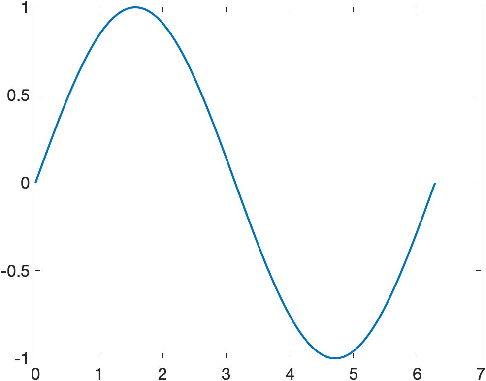
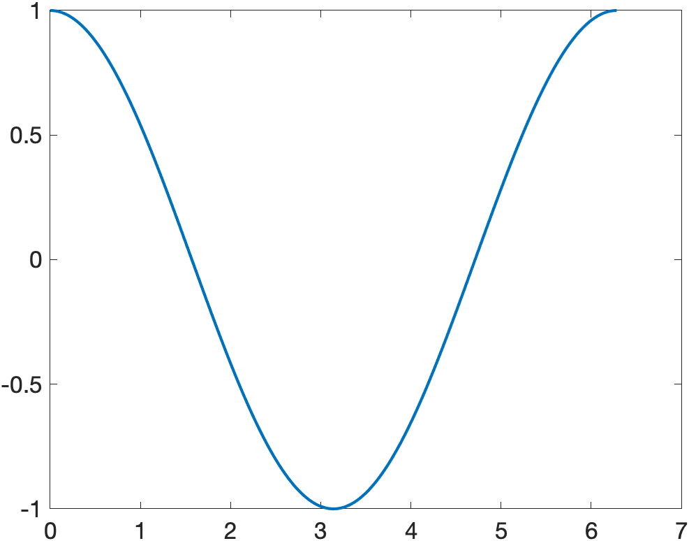
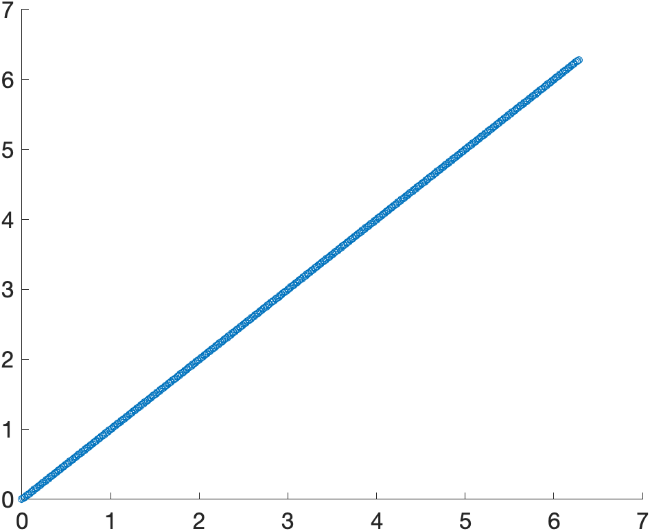
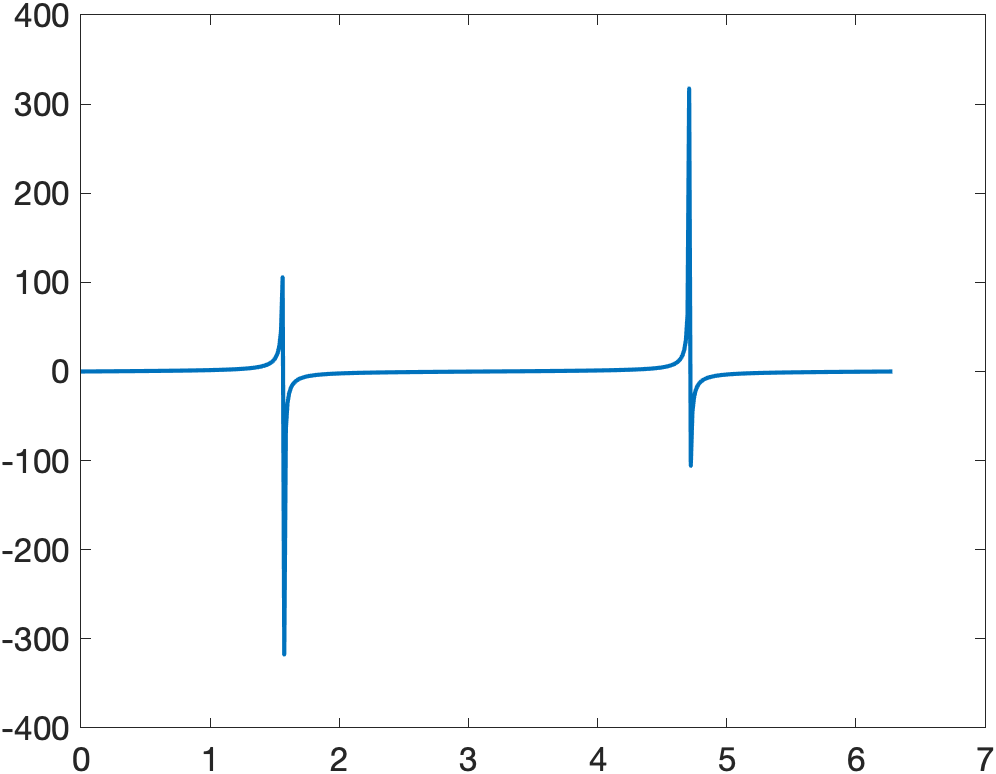
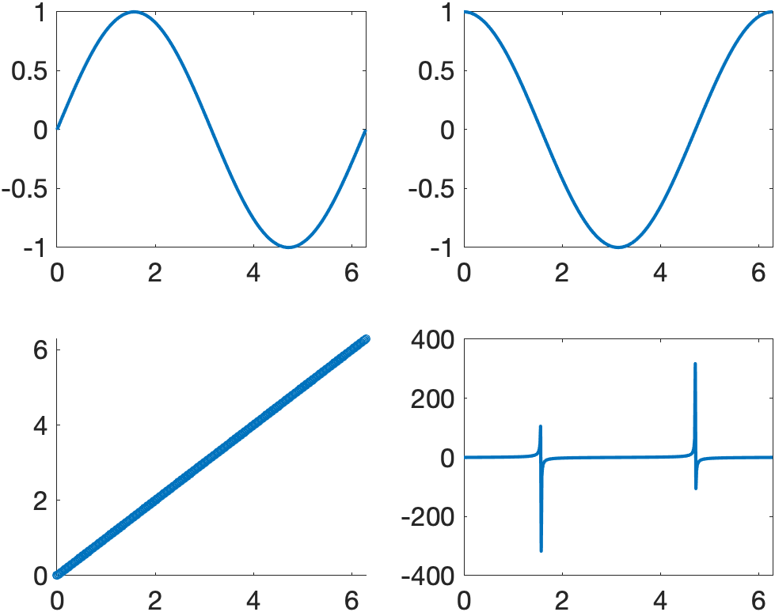
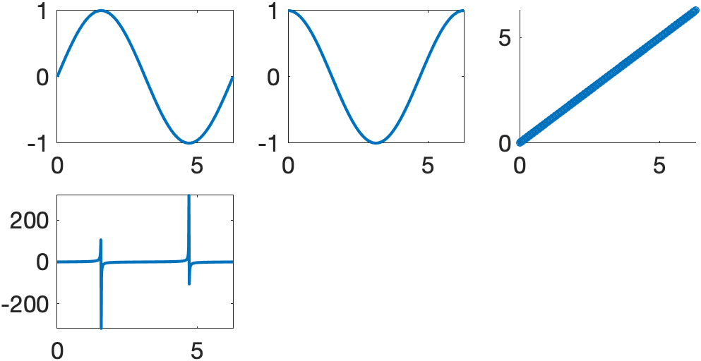

# [individPlots2SubPlots](https://github.com/tulimid1/individualPlots2SubPlots-matlab/blob/main/individPlots2SubPlots.m) 
---

Take individual figures and put them together into one figure with multiple subplot. See [iP2SP_examples.mlx](https://www.mathworks.com/matlabcentral/fileexchange/104710-individualplots2subplots-matlab) for a notebook of given examples. 

## Syntax
---
[individPlots2SubPlots(axS, subplotDim)](#a)

## Description
---
### A
individPlots2SubPlots([axS](#axs), [subplotDim](#subplotdim)) returns one figure with subplots of dimesion [subplotDim](#subplotDim) that contains axes defined in [axS](#axS). [example](#example-1)

## Examples 
---
### Example 1
Generate four figures and put their contents into one figure with a 2x2 subplot layout. 

    % generate some data 
    x = linspace(0, 2*pi, 500);

    figure();
    ax(1) = gca(); 
    plot(x, sin(x), 'linewidth', 2)
    set(ax(1),'fontsize', 16);


    
    figure();
    ax(2) = gca(); 
    plot(x, cos(x), 'linewidth', 2)
    set(ax(2), 'fontsize', 16);
    

    
    figure();
    ax(3) = gca(); 
    scatter(x, x, 25)
    set(ax(3), 'fontsize', 16)
    

    
    figure();
    ax(4) = gca(); 
    plot(x, tan(x), 'linewidth', 2)
    set(ax(4), 'fontsize', 16)



    individPlots2SubPlots(ax, [2,2])
    

    
### Example 2
Generate four figures and put their contents into one figure with a 3x3 subplot layout. 

    % generate some data 
    x = linspace(0, 2*pi, 500);

    figure();
    ax(1) = gca(); 
    plot(x, sin(x), 'linewidth', 2)
    set(ax(1),'fontsize', 16);


    
    figure();
    ax(2) = gca(); 
    plot(x, cos(x), 'linewidth', 2)
    set(ax(2), 'fontsize', 16);
    

    
    figure();
    ax(3) = gca(); 
    scatter(x, x, 25)
    set(ax(3), 'fontsize', 16)
    

    
    figure();
    ax(4) = gca(); 
    plot(x, tan(x), 'linewidth', 2)
    set(ax(4), 'fontsize', 16)


    individPlots2SubPlots(ax, [3,3])
    


## Input Arguments
---
### ```axS```
Vector of axes handles

1D vector that contains all axis handles to be plotted together. 

Data Types: (vector, axes handles)

### ```subplotDim```
Subplot dimensions for final figure

Subplot layout for output figure. 

Data Types: (vector, numeric)

## More About 
---

## Tips 
---

This is all this function does (a good function does 1 thing and 1 thing only). You can get the figure and axis after and edit the properties. 

## Issues and Discussion
---

[Issues](https://github.com/tulimid1/individualPlots2SubPlots-matlab/issues) and [Discussion](https://github.com/tulimid1/individualPlots2SubPlots-matlab/discussions).

If you don't know how to use github (or don't want to), just send me an [email](mailto:tulimid@udel.edu). 
